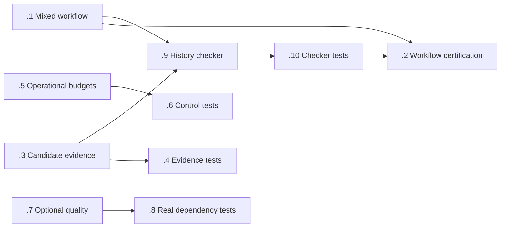
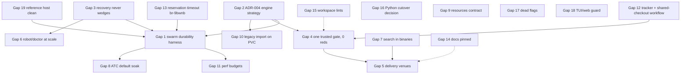

# Bridge Plan: MCP Agent Mail (Rust)

**Current assessment: September 8, 2026 — requested complete reality check.**
This assessment supersedes the September 4 and September 2 assessments retained
below. The audit began at `ba2ad9ce`; peer changes subsequently advanced the code
through `4717f869`. Released v0.3.34 is still `0125f050`. These are different
subjects of verification.

## September 8 judgment

**The core product is real and useful; reliable operation under contention and
strict release acceptance are unfinished.** This is no longer a missing-server
or empty-command problem. Actual released binaries can register agents, reserve
paths, send/read/ack/reply, serve resources, and enforce the archive-backed guard.
However, a fresh execution of the canonical workflow failed its concurrent HTTP
phase, the last complete workspace run had 12 failures, and manual publication
did not satisfy the documented zero-failure gate. Those facts outweigh the large
number of closed issues when deciding whether the project is finished.

The highest return comes from delivering already-tested isolated repairs,
resolving the remaining database/recovery failures, and making the existing
release and workflow machinery decisive. Another architecture, dashboard,
replacement engine, or broad feature campaign would dilute that work.

### Evidence and its limits

- Read all 1,339 lines of `AGENTS.md` and all initial 1,993 lines of `README.md`.
  Read the subsequent 15-line README addition for the newly landed guard bounds.
  Reviewed the existing full September 4 vision/plan audit, current documentation
  index, durability contract, verification realism/closure policy and release
  gates. Compared plan/spec documentation since the earlier assessment: only
  this bridge changed before the concurrent README addition. Historical document
  reads and measurements are reused explicitly; they are not new executions.
- Initial tracker inventory: **2,457 issues: 2,289 closed, 90 open, 77 in progress,
  one blocked**. Thus 168 unfinished issues, not 90. `bv` reported 155 actionable
  and 13 not actionable; actionable does not mean unowned. Its top suggestion
  was an old mirror-sync task, demonstrating why graph ranking needs source and
  release evidence before taking action.
- Live GitHub API confirmed v0.3.34 public, published September 8 at 02:58:05 UTC,
  with 25 uploaded assets. Prior retained receipts establish six target families,
  signed public downloads, Bash install/update, Homebrew formula publication and
  dual-architecture GHCR publication. Linux ARM execution used QEMU; Intel Mac
  used Rosetta. A fresh full PowerShell installer and `brew install` were not
  executed. Every active crate remains `publish = false`; crates.io is an explicit
  product decision (`br-95spu`), not a venue silently completed by this release.
- Full nextest receipt at source `43459c5a`, run
  `f70dd3fe-fc26-4d85-a6aa-a1dcc3aaf19c`: **17,384 executed, 17,372 passed,
  12 failed, 37 skipped, two passing tests reported leaky**, exit 100. Raw log
  SHA-256 `265e326d0a11f1c8ab66f31ffa0d41f62f840c85bd023aa888323ec0ea890d48`.
  Final release-source check, Clippy with warnings denied, formatting and 123
  focused tests passed. Neither result validates the later peer commits or
  changes the red full-suite verdict.
- **Fresh published-binary workflow, 19:19:23–19:20:09 UTC:** 41 assertions passed,
  one failed, zero skipped. Phases 1–8 passed. Phase 9 completed HTTP initialize,
  send, inbox and ack, then RedFox's concurrent `register_agent` returned
  `RESOURCE_BUSY` / `busy_retryable`; the client exited before the ready barrier.
  The other two clients were terminated by the owned harness and the server
  exited 0. The reopen portion was not reached. This is a real failed workflow,
  not evidence of lost mail or a proven new engine regression. The server calls
  the error recoverable; the fixture currently requires first-attempt success.
  That acceptance mismatch must be resolved explicitly, with bounded retry and
  durable identity checks if retry is the intended contract.
- That fresh run used release `am` SHA-256
  `5931c453048d78154046865986a2c274e6189cc53714e418967b77b38f0785c7` and server
  SHA-256 `687d5569130a7366cfe2abad2b6510ceec2acf8d618b49e9dab34c282aa94f20`.
  Both workflow script and common harness hashes match the frozen source manifest.
  The earlier 42/42 run remains valid for its own invocation; it cannot erase
  this failure. No retry-until-green loop was run.
- Local `timeout 15s am doctor health` returned 124 after reporting
  `local_config_unattested` and migration work on its private probe copy. This is
  no health verdict about the shared mailbox. The separate authoritative
  reservation snapshot was conflict-free and lease 9572 was granted for this
  document. No shared-mailbox repair or process takeover was attempted.
- Keyword and Rust AST scans found no `todo!()` or `unimplemented!()` calls in
  `crates`. Real handlers and known failures are stronger evidence than this
  absence. Explicit model/encoder substitutes remain proof limitations, not
  missing implementations inferred from a keyword.

Evidence roots: local/CSS `/data/projects/am-release-0334-artifacts-20260908`;
fresh execution on CSS under `reality-check-0908-7_egxbm3/` with the terminal
`final-release-workflow-receipt.json`, full stdout and each client's stderr and
history. Published release: https://github.com/Dicklesworthstone/mcp_agent_mail_rust/releases/tag/v0.3.34.

### Vision checklist: present capability, remaining gap, owner

`WORKING` below is bounded to the named executed path. `PARTIAL` includes known
integration defects. `UNPROVEN` means the required current proof is absent, not
that implementation is absent. No whole-product completion percentage is used.

| # | Promise from README / governing contracts | Current assessment | Remaining work and existing coverage |
|---|---|---|---|
| 1 | Discoverable tools and real MCP dispatch | WORKING for exercised handlers; 45-tool source/retained discovery | Full per-tool closure: `br-l1q6z`, conformance. Registry counts alone prove no behavior. |
| 2 | Inbox/thread and other resources | WORKING for fresh inbox/thread; wider 25-resource contract PARTIAL | `resources.rs`, conformance and `br-4meup`; no empty-resource rewrite. |
| 3 | Send, reply, read/ack and explicit routing | WORKING sequentially in fresh release run; concurrency PARTIAL | `messaging.rs`, `queries.rs`; `br-kp1in.1/.2`, `br-sa58k`, `br-oeam8`, `br-e0blb`. |
| 4 | Broadcast intentionally forbidden | Implemented refusal and tests at both normalization/tool boundaries | Preserve rejection at `messaging.rs:1136,1891`; no broadcast feature task. |
| 5 | DB commit plus durable Git recovery ledger | PARTIAL: real persistence/archive pipeline and offline parity pass | `br-0flbu`, `br-htobc`, `br-kp1in.1/.2/.9/.10`, `br-8j6cb`; eventual archive is not synchronous commit. |
| 6 | Concurrent agents without wedges or corruption | PARTIAL: fresh three-client identity contention failed workflow | `br-kp1in.1/.2`, `br-22gm3`, `br-qz7rz`, `br-fkam4`, `br-9bwnb`; retain retry/cancellation histories. |
| 7 | Recover corrupt state without false health or source loss | PARTIAL; multiple full-suite failures; new source recovery fix `ad87cdb8` | `br-qdgio`, `br-r6psd`, `br-sd3md`, `br-kp1in.12`, `br-l1q6z`; validate new promotion behavior, not just a refusal. |
| 8 | FrankenSQLite runtime and structured async | Real fsqlite 0.3.18/asupersync 0.4.9; lifecycle guarantee PARTIAL | Canonical SQLite remains verification/recovery only. `br-tl2sg`, `br-22gm3`, engine probes; no policy/default reversal. |
| 9 | Scoped identities, contacts and durable topics | PARTIAL; identity sequential pass, concurrent Busy; new source contact repair `708ae6ba` | `contacts.rs`, `macros.rs`; `br-g6c0z`, `br-sgaee`, `br-qayvs`, current conformance gate. |
| 10 | Reservations, TTL/release and commit/push guard | WORKING for fresh offline lifecycle/guard; broader bounds PARTIAL | New source guard `4717f869` is not in release; `br-ssog9`, `br-l1q6z`; preserve advisory semantics. |
| 11 | Product bus and advisory build slots | Real handlers, current complete behavior UNPROVEN | Existing mixed workflow and conformance; `br-kp1in.1/.2`; membership/privacy and expiry remain acceptance. |
| 12 | Useful 16-screen TUI | Real implementation; current visual/interaction proof PARTIAL | `br-boq46`, `br-y8k4z`, `br-mljnz`, full TUI traversal; snapshots are not live input proof. |
| 13 | Web mailbox/archive review | PARTIAL; two archive HTTP failures and static-export failure | `mail_ui.rs:71` opens DB before archive dispatch; validated isolated routing repair remains unlanded under `br-l1q6z`. |
| 14 | Robot snapshots and noninteractive CLI | WORKING for sampled agents/list; broader truth PARTIAL | `robot.rs`; `br-4myjj`, `br-eru3j`, `br-49eak`; recheck stale titles before reimplementing fixes. |
| 15 | Reversible, scoped, owner-safe doctor | PARTIAL; real seven-op mutation/undo machinery, failed integrity cases | `doctor/mutate.rs`, `br-x2jf5`, `br-6u4hx`, recovery tasks; local unattested timeout is not live health. |
| 16 | Agent setup, config authority and secret safety | PARTIAL; substantial real integration and unfinished authority tasks | `br-siq0z`, `br-ww5js`, `br-q8k82`, `br-3cqr4`, `br-x5a8y`, `br-fphbm`. |
| 17 | Search V3 lexical and optional hybrid | Real integration; route/quality coverage PARTIAL | `search_service.rs`; `br-7x5fm`, `br-ku0kl`, `br-eh8bj`, `br-kp1in.7/.8`; portable release is lexical. |
| 18 | Useful optional summaries and compact output | PARTIAL; offline substitutes cannot establish model/encoder quality | `br-kp1in.7/.8`; actual selected model/encoder, scope canaries and semantic round trip required. |
| 19 | ATC learning with quiet, safe defaults | PARTIAL; fresh default-disabled workflow; learning test still red | `br-hwney`, `br-au76r`, `br-kp1in.1/.2`; isolated enabled fixture fix is not file-backed restart proof. |
| 20 | Share/export encryption and hosted verification | Real crypto/bundle code; complete current hosted path UNPROVEN | `share/src`, `br-ji2f0`, security/share real-path gates; no synthetic-only closure. |
| 21 | Signed installation/update and all supported venues | WORKING within retained platform/install/update scopes; release acceptance PARTIAL | GitHub/Homebrew/GHCR delivered; `br-bx73n`, `br-nq2kb`, `br-kp1in.3/.4`; native installer gaps disclosed. |
| 22 | Lossless legacy import and deliberate old-repo cutover | PARTIAL; source import/reopen fixes and unresolved authority tasks | `br-dbt24`, `br-lkhxw`, `br-mrfhc`, `br-p4s42`, `br-ajiq8`; no inferred cutover/deletion. |
| 23 | Current complete correctness and installed parity | PARTIAL: retained 12-red full run; later source has no new full verdict here | `br-l1q6z`, `br-bx73n`; ignored installed parity must run explicitly with exact paths. |
| 24 | Measured latency/resource budgets | UNPROVEN at current candidate/load; dated baselines only | `br-kp1in.5/.6`, `br-eru3j`, `br-y8k4z`; report workload, route, errors and resource growth with latency. |
| 25 | Honest docs and explicit public replay/browser boundary | PARTIAL; replay deliberately sanitized, live browser mirror deferred | `br-4meup`, `br-f9avw/.10`, `br-mq9q1`; stale gate/topology prose must not redefine current scope. |

**Would completing the existing backlog close the gaps?** It covers every
identified goal at the capability-family level. No new untracked feature family
was found in this refresh. But completing stale task descriptions literally
would not finish the project: some still call for Actions, claim absent containers,
or ask for already-landed scorecard code, while strict manual publication and
concurrent retry acceptance need explicit current criteria. Revise those existing
issues rather than create a second backlog. Implementation plus current real-path
acceptance closes bounded promises; it cannot prove universal zero deadlocks,
corruption or future performance.

## September 8 bridge and execution order

1. **Deliver the small existing repairs (S–M, highest immediate return).** Under
   `br-l1q6z`, review the isolated archive-routing, polling, environment and ATC
   fixtures against current main, reserve their paths, resolve drift, and land
   only reviewed changes. Archive dispatch must work from actual committed Git
   content with unusable DB configuration, retaining auth/method/path checks.
   Polling must return bounded errors without weakening cancellation semantics.
   `br-ue7e5` similarly retains the tested CORS `Vary` repair. Prior candidate
   passes are evidence to reuse, not proof of current delivery. Do not project a
   reduced full-suite failure count from focused tests.
2. **Finish database/recovery correctness (M–L, critical path).** Classify each of
   the 12 retained failures, distinguish fixture authority from physical integrity,
   and validate new recovery commit `ad87cdb8`. Preserve corruption negatives,
   same-process writer exclusion, hot-WAL truth, stable generation and no-clobber
   promotion. `br-kp1in.12` stays blocked until its snapshot semantics work with
   the actual runtime engine. Engine-level minimal reproductions remain separate
   from application workaround proof; do not silently swap the runtime engine.
3. **Make multi-process workflows meet their actual retry contract (M).** Extend
   `br-kp1in.1/.2` from the retained failed three-client registration. Choose and
   document whether first-attempt registration must succeed or bounded Busy retry
   is supported. If retry is allowed, retain every error and attempt, reuse the
   requested identity, prove one durable identity/profile, cap elapsed time and
   attempts, and complete the send/reopen/archive assertions. A fixed-delay
   rerun-until-green or suppressing `isError` does not count.
4. **Finish child/resource lifetime bounds (S–M).** `br-tl2sg` owns the detached
   stdout reader in `run_tmux_bounded`: caller timeout does not stop `read_to_end`
   when a descendant holds the pipe. Include real descendant and sustained-output
   fixtures, bounded memory, cleanup/join evidence and repeated-probe thread/FD
   counts. Keep large finite output and unavailable-pane behavior; no unsafe code.
5. **Connect current release gates to manual publication (M).** Keep Actions
   disabled. `br-nq2kb` must gate the DSR/manual path, using `br-kp1in.3/.4`'s
   existing candidate-bound code and `br-bx73n`'s installed parity/reliability
   receipts. Deliberately red lint/test, absent required suite, wrong binary and
   incomplete producer must prevent the local publish transition. A signed asset
   proves provenance, not correctness. No retroactive green release claim and no
   deletion/replacement of published assets.
6. **Earn sustained reliability and performance claims (L).** Complete the
   existing mixed histories `.1/.2/.9/.10` before the proposed 24-hour/two-host
   workload; the smoke must first complete. Use `.5/.6` to measure actual routes,
   offered/completed rates, p95/p99, queue occupancy, errors, memory/FD/disk and
   archive lag. A/A and paired windows matter for comparative claims; absolute
   budget misses remain visible even if comparisons have no verdict. Do not turn
   a historical gauntlet into a universal safety guarantee.
7. **Finish selected optional and user surfaces (M–L, independent lanes).**
   `.7/.8` require real selected dependency evidence. TUI input, scoped web/share,
   setup secrets and legacy import keep their existing owners and strong tests.
   Optional hybrid/LLM is not a hidden dependency of a lexical-only release.
8. **Reconcile the documentation last (S).** `br-4meup` must distinguish working,
   shipped, tested and deferred. Replace stale topology and absolutist claims
   with dated boundaries while preserving the actual goals. The root historical
   TODO's checked boxes are not present-day correctness certificates.

No implementation task waits on a new audit epic. Existing implementation/test
pairs remain `.1/.2`, `.3/.4`, `.5/.6`, `.7/.8`, `.9/.10`. Causal product repairs
can proceed while tests are authored; only certification waits on their result.

## September 8 skill execution and granular TODO

The frozen Phase 3a and Phase 5 instructions retained verbatim in the September 4
record below are applied again to the current gaps. Existing self-contained
Beads are the generated work graph: regeneration updates their current evidence,
implementation/test requirements and dependencies instead of duplicating them.

- [x] Read complete AGENTS and README; inspect later README/source drift.
- [x] Read skill and references; compare current contracts with prior full audit.
- [x] Inventory every tracker status, existing ownership, and initial `bv` triage.
- [x] Inspect source wiring, AST placeholder scan, release identity and receipts.
- [x] Execute actual released software in a fresh private remote workflow.
- [x] Investigate the failed phase and preserve its original terminal artifacts.
- [x] Produce 25-goal coverage matrix and concrete prioritized bridge.
- [x] Phase 3a: revise existing Beads with current evidence and acceptance.
- [x] Ambition round 1: improve repair delivery and contract-level integration.
- [x] Ambition round 2: improve fault/retry histories and resource bounds.
- [x] Ambition round 3: improve causal release gates and measurable claims.
- [x] Regenerate Beads from those improvements without duplicate tasks.
- [x] Refinement 1: stale scope, ownership and coverage.
- [x] Refinement 2: preserved behavior and realistic positive/negative tests.
- [x] Refinement 3: exact source, executed artifacts and evidence retention.
- [x] Refinement 4: dependencies and practical execution order.
- [x] Refinement 5: fresh convergence check, `br` cycles and `bv` triage.
- [x] Validate the document/tracker delta and report honest completion limits.

Process creation gate: this report is requested explicitly by the project owner
to decide the next implementation priorities. It catches the observed stale
assessment, red release gate and failed concurrent workflow. It earns zero
capability credit and is retired as active guidance when the next assessment
supersedes it; historical material is retained, not deleted. The highest-value
implementation remains the already-tested archive/runtime repairs, and this
assessment must hand back to that work after its requested phases.

### Ambition round 1 — complete the operator journey

The initial list fixes individual failures, but the user needs one coherent
mailbox through normal operation, trouble and recovery. Extend the existing
mixed workflow to cover **the same message identities and recipient state**
through live operation, verified archive fallback, supervised recovery and resumed
live operation. Check that a healthy primary still supplies fresh reads and that
archive-only browsing remains available when database opening fails. A successful
recovery must make new messages usable, not merely return a safe refusal.

This also improves delivery order: use separate, reviewable patches for archive
dispatch, polling, environment ownership and CORS, then run their combined real
workflow. Passing each isolated candidate is insufficient if the combined source
changes routing or cancellation. The later peer recovery/contact/guard changes
must be included in that integration candidate. Keep the safety negatives and
original feature behavior; do not turn the sequence into destructive production
recovery or add a second recovery runner.

### Ambition round 2 — separate safe retry from hidden overload

For the observed Busy response, an operation history must distinguish requested,
admitted, committed, replied and retried operations. Record first-attempt success,
eventual success, deadline failures and attempts per completed operation. A
healthy eventual result with rapidly growing attempts or queue/resource usage
still fails the declared operational budget. Retry only explicit retryable
responses within one original deadline; do not restart the clock per attempt.
Timeouts with unknown commit outcome require reconciliation before repeating a
mutation. This extends the existing bounded history checker rather than adding
another event schema or production telemetry service.

The cancellation boundary also includes retained pipes and output memory. The
tmux fixture needs a finite output control, an output-flood overflow case, an
inherited-pipe case and repeated probes. Cap accepted bytes before allocating
without limit, and prove the mechanism releases owned readers and children.
An error response at two seconds is not proof that resources were reclaimed.
Use independent bounds for caller latency, output bytes and cleanup grace.

### Ambition round 3 — make release acceptance follow the actual executable

The candidate-bound scorecard is valuable only if the manual publisher consumes
it. Define one immutable candidate input to the existing release entrypoint:
source and dirty-overlay identity, dependency closure, features, targets and
artifact digests. Required suites and installed parity must resolve to that same
candidate. Validate again immediately before the publish transition so a changed
artifact or substituted successful report cannot inherit an earlier approval.
Exercise the local transition with a valid positive and one altered term at a
time; no external test release is necessary.

Keep two conclusions explicit: distribution successfully published, and strict
acceptance satisfied. v0.3.34 meets the first within its documented scope; its
retained 12-failure workspace result prevents the second. An optional, unselected
hybrid/model lane cannot block a lexical-only candidate, but failed required
correctness cannot be relabeled optional after observing its result. The existing
release gate and its tests should enforce this; no second ledger or dashboard.

Bead regeneration adds these improvements to the existing implementation/test
pairs and publication owners. There are zero new issues: the contribution is
current, executable acceptance and a shorter route to delivery, not a larger queue.

### Five fresh refinement passes

1. **Scope and ownership:** checked all 25 rows against the complete issue
   inventory and current source. Updated obsolete manual-release/container task
   titles and attached the delivered GHCR evidence without claiming an unrun
   public pull. Kept every status/assignee intact. Candidate scorecard code is
   already present; its consumer/evidence is the remaining work. Gate development
   must not wait for every product repair; publication does. Shared runner file
   edits require one reservation owner at a time.
2. **Behavior and tests:** extended the existing history and performance
   companion tasks with legal Busy/retry/stable-identity and illegal duplicate
   histories, nonretryable auth/argument errors, deadline exhaustion, preserved
   read/ack state and completion-versus-amplification controls. Real process/DB
   observations remain decisive; synthetic counterexamples test the checker,
   not the product. No existing assertions, fixtures or functionality removed.
3. **Evidence identity:** verified the retained full-nextest log against its
   recorded SHA-256 and the fresh workflow/common-harness hashes against the
   release manifest. Separated released `0125f050`, full-test `43459c5a` and
   peer source `4717f869` (metadata HEAD `bd21aeb6`). The required installed
   parity/reliability packet remains missing from the retained release evidence;
   signatures and smoke do not substitute. Both successful and failed workflow
   invocations remain visible, without a new-engine regression claim.
4. **Dependencies and completion:** checked the real `.1/.3 -> .9 -> .10 -> .2`
   prerequisite chain and the independent budget/optional-quality pairs. Kept
   those edges; added no parent/child cycles or blanket product-bug dependency
   that would prevent authoring the publication gate. Found a genuine acceptance
   hole in `br-l1q6z`: its checklist required a recorded run but not restoration
   to zero unresolved required failures. Added that criterion explicitly so a
   well-documented red run cannot close the restoration task. Existing skips and
   leaky results must remain disclosed. `br ready` exposes the unowned budget
   lane, manual acceptance and tmux task; the tested repair lanes retain owners.
5. **Convergence:** rereviewed all 25 vision rows, the revised acceptance,
   implementation/test pairings, preserved defaults and source/evidence
   boundaries. No further scope or dependency changes were needed. Fresh `br`
   inventory has the same 2,457 IDs, zero additions/removals, and zero status or
   assignee changes. All literal Bead IDs in this assessment resolve. Final
   `bv --robot-triage` completed; `br dep cycles --json` reports zero active
   cycles. `git diff --check` passes. Scoped UBS exits 3 because Markdown is
   unsupported: it ran no scanner and is not reported as a pass.

### Honesty and work audit

Window: this September 8 reality-check request, with the prior release packet
reviewed specifically for claims being relied on. The product's purpose is
persistent, auditable coordination between coding agents. Output classification:
one updated assessment and the existing Bead revisions are **PROCESS**; no USER
or ENABLER implementation is claimed. The fresh actual-binary run provides
evidence, not a new feature. This is bounded work requested by the operator;
its next consumer is the implementation owner choosing the repair sequence.

Creation worksheet: running code does not branch on this report. The explicit
operator request supplies its consumer and decision gate; observed defects are
the stale assessment, failed concurrent workflow and unmet release acceptance.
It retires as active guidance at the next assessment. The integrity-control
exception is unnecessary: the explicit request already qualifies it. Its minimal
form is this existing document and existing tracker, not another report system.
An hour on the existing archive/polling repairs would yield more runtime benefit;
the assessment therefore stops here and hands off to them.

Real-work worksheet: no feature shipped in this audit to demonstrate; the earlier
release and new peer fixes are not credited to it. Without the process work, the
same binaries would exist, but the user would lack this requested correction and
prioritized plan. No speculative runtime enabler was created. Long-standing
durability/corruption work (`br-htobc` among the oldest actionable rows) remains
valuable; this window addressed the explicitly requested steering instead.
No new swarm was dispatched, no closure count is used as progress, and no task
was split to close an unmet parent. Disposition: legitimate requested assessment,
zero capability credit; another planning round would be drift.

Honesty inventory, numbered against the skill worksheet:

1. No test weakened/deleted/ignored (checked: this turn's diff contains only this
   document and Beads; the restoration criterion was strengthened).
2. No test double introduced (checked: no test/source edits).
3. No golden regenerated (checked: no test/fixture edits by this audit; peer
   contact fixture changes are separately identified, not certified here).
4. No validator/CI relaxation (checked: no runtime gate edits; any `[skip ci]`
   commit annotation follows the user's explicit no-Actions instruction).
5. No fabricated gate satisfaction (checked: red full suite and failed workflow
   are retained and prevent a strict-ready claim).
6. No zero-run green (checked: 41/1 fresh assertions; AST zero matches is only a
   scan result; UBS exit 3 is explicitly no scan).
7. No unrun-command claim (checked: full suite is retained evidence at its named
   source, not a fresh run of the later main; missing parity is disclosed).
8. No fixture upgraded to live proof (checked: actual release binaries and real
   transport/storage for the fresh run; model/encoder substitutes stay limited).
9. **Correction required for prior release wording:** publication completion must
   not mean every release gate passed. The retained 12-failure suite and absent
   mandatory parity/scorecard packet leave strict acceptance unfinished. This
   correction is explicit here and on `br-nq2kb`/`br-bx73n`; failed required
   tests cannot be made optional after the result is known.
10. No cited command hides stderr (checked: failed client stderr and suite output
    retained; unsupported UBS and initial inventory-parser errors disclosed).
11. No unmet item closed (checked: all initial statuses and assignees preserved).
12. No requirement rewritten to match success (checked: zero-failure gate retained;
    concurrent Busy retry remains an explicit acceptance decision with negatives).
13–17. No new delegated agents or accepted subagent assertions in this window;
    peer commits are source observations, not independently verified tests or
    agreement-based proof. No refusal farming or delegated closures are credited.
18. Denominators are the complete retained run and the complete fresh workflow;
    no passing subset substitutes for either.
19. The moments requiring explanation are the initial inventory parser expecting
    an array instead of the returned object, one optional-field parser correction,
    the failed workflow and the release-completion distinction. Parser errors
    were corrected before deriving inventory claims; product failures stay red.
20. Strongest evidence: re-executable release workflow with exact binary/harness
    hashes, 41 passing assertions, original failed client stderr and joined process
    outcomes. Source/Bead validation is a separate, reproducible document check.

No additional CASS-wide older-session honesty sweep is claimed; this window uses
the retained release receipts and current source directly. The prior-release
wording correction is recorded in place, disclosed to the operator, and guarded
by explicit zero-failure acceptance on `br-l1q6z` and the manual publisher task
(`RH-9` follow-up laundering / `RH-10` plan edits cannot stand in for delivery).
Review is solo and bounded, not independent verification of new peer code.

**Handoff:** all requested skill phases are complete. The project remains
unfinished for the reasons above; implementation Beads remain open. Resume the
existing repair-delivery lane, then complete actual concurrent/recovery workflow
acceptance and the manual release gate. Do not create another planning campaign.

## Historical September 4 assessment (superseded)

<details>
<summary>September 4 assessment and earlier retained proposal; use September 8 guidance above</summary>

**Current assessment:** 2026-09-04, GentleBeaver, requested full `reality-check-for-project` workflow.
**Source reviewed:** `a6ebaf5057ad40f5de16b3c44b35e8472bf5c699` on `main`; earlier observations began at `ff47e953`. The checkout changed during the audit, so observations identify their actual revision or binary.
**Installed executable:** `am 0.3.32`, SHA-256 `8eea1560ece6d30912af107d2de5f4f66e9a8b4ece2d447ea239c0f6b23975d3`. This is not evidence that the installed executable contains current `main`.

This September 4 assessment supersedes every recommendation in the collapsed September 2 proposal below. That proposal is retained as historical evidence, not as instructions to perform repairs, delete artifacts, change defaults, or reopen completed work. No production code, shared mailbox repair, release publication, or engine migration is part of this assessment.

## Assessment and evidence boundaries

**Agent Mail has a substantial real implementation, but current evidence does not establish a finished, reliably releasable product.** Messaging, persistence, recovery, search, CLI, TUI, web, guard, share, and ATC contain real code and extensive tests. The strongest concerns are the failed basic installed-binary send, a live unhealthy integrity verdict, unresolved engine/visibility cases, unavailable current full-suite verification, and release evidence that is not sufficiently tied to a particular candidate. A count of closed Beads is not a completion percentage.

The audit read all of `AGENTS.md` and `README.md`, the root and `docs/planning` vision/transition/architecture plans (including full Python-behavior extraction), accepted and superseded ADRs, current SPEC/design documents, release/rollout plans, ATC/search/TUI contracts, and verification/performance ledgers. Identical duplicates were verified by content hashes; divergent copies were read through their differences. Historical results remain historical. Keyword, Rust AST, and behavioral inspection were combined: the `todo!`/`unimplemented!` AST scans found no hits in `crates`, while inspected stub encoders and LLM fixtures are explicit test substitutes. This does not prove every implementation correct.

| Evidence | Actual result | What it establishes |
|---|---|---|
| Isolated installed-binary stdio workflow | Initialize, list 45 tools, list resource templates, create project, and register BlueLake/GreenStone passed. First `send_message` returned JSON-RPC `-32004`, `Request timeout exceeded`, after 30,003 ms. Server exited 0 after stdin closed. | Basic workflow failed in this environment. Inbox/ack/search/reservation/build-slot/broadcast cases after send were **not reached**. No causal diagnosis of the timeout or claim of current-main regression. |
| Live MCP `health_check` | Red integrity verdict: a prior failed full check remains authoritative despite a later passing quick check. Other reported sections green; archive/DB message totals both 40,479 at observation. | A quick check must not erase known full-check failure. Equal aggregate counts do not prove row-level parity or healthy storage. No repair was attempted. |
| Live session coordination | `macro_start_session` timed out at 30 s in unattributed blocking dispatch, but GentleBeaver registration persisted. Granular reservation of this plan succeeded; inbox was empty. | A timed-out composite request can have partial effects. Repeating the whole macro without checking state is unsafe as a correctness assumption. Stage was not attributed to SQLite or archive. |
| Standalone `am doctor health` | Exit 1 with `local_config_unattested`; private probe reported six reservation-field differences. | Not an attested probe of the same live target. Do not conflate this result with the live MCP integrity verdict. Private probe artifacts were retained. |
| Current-source remote nextest, source receipt | Rejected non-regular `.doctor/latest` symlink during transfer. | `NO_VERDICT`: zero tests ran. Do not remove the symlink to satisfy transfer. |
| Current-source remote nextest, clean overlay at `a6ebaf50` | Cargo manifest loading failed: gated sibling `../frankensearch-rel-0332/frankensearch/Cargo.toml` missing on worker. | `NO_VERDICT`: no compilation or tests. Existing `br-rch-frankensearch-closure-jdgvg` owns dependency closure. No local build fallback used. |
| Latest full-suite result recorded in Beads | `br-l1q6z`, comment 2677: gate 8 at `a04a5807`, September 3, 17,270 run, 16 failed, 37 skipped. Later comments report focused fixes. | Historical recorded result, not independently replayed here. Neither the old ~212 nor projected 14 is a current measured failure count. |
| Public release and automation, live GitHub API | Latest release v0.3.32, September 1, six target families. Core CI/dist/docker/publish workflows disabled manually. Issue-138 one-shot succeeded September 4; latest coordinated release-risk runs failed. | Release assets exist; this audit did not install/verify each asset. A specialized green job is not a full release gate. |

Local evidence retained: `/tmp/am-reality-runtime-v2-20260904.log`, `/data/tmp/am-reality-20260904-ldf22flm/{summary.json,transcript.jsonl,server.stderr}`, `/tmp/am-reality-nextest-20260904.log`, `/tmp/am-reality-nextest-clean-20260904.log`, `/tmp/am-reality-health-20260904.log`, and `/tmp/am-reality-beads-initial-20260904.json`. The first probe's missing `notifications/initialized` was corrected in the harness; that protocol error is excluded from product findings. These host-local paths are audit breadcrumbs, not durable release receipts.

Public references: [v0.3.32 release](https://github.com/Dicklesworthstone/mcp_agent_mail_rust/releases/tag/v0.3.32), [successful narrow one-shot](https://github.com/Dicklesworthstone/mcp_agent_mail_rust/actions/runs/33890295033), [failed release-risk run](https://github.com/Dicklesworthstone/mcp_agent_mail_rust/actions/runs/33882137179). Workflow state was obtained through the live API rather than cached Actions HTML.

## Vision checklist and coverage

`WORKING (bounded)` below applies only to the behavior actually exercised. `PARTIAL` means implementation exists with known missing or failing integration; `UNPROVEN` means this audit could not establish the promised behavior. Source presence and historical tests are explicitly distinguished. No whole-product percentage is assigned.

| # | Testable promise and authority | Current status and implementation evidence | Remaining coverage / disposition |
|---|---|---|---|
| 1 | 45 discoverable tools; README tools/AGENTS registry | WORKING (bounded): installed `tools/list` returned 45; real handlers in `tools/src` | Per-tool behavior remains part of `br-l1q6z` and conformance, not proven by listing. |
| 2 | 25 logical resource contracts; README/AGENTS | PARTIAL: `tools/src/resources.rs`; recent-ring/filter implementation now real (`br-ciwph` closed) | Preserve 25 logical templates versus raw handler count; `br-4meup`, current conformance gate. Do not recreate the fixed empty-resource defect. |
| 3 | Explicit recipients, replies, topics, read/ack, retry; README | PARTIAL: `messaging.rs`, `queries.rs` transactional inserts and idempotency; installed send timed out | `br-sa58k`, `br-oeam8`, `br-e0blb`, `br-l1q6z`; new mixed-workflow acceptance. |
| 4 | Never broadcast; AGENTS Rule 2 | UNPROVEN in fresh execution, implemented refusal at tool boundary | Keep rejection and its tests; include negative control in mixed workflow. No feature request to enable it. |
| 5 | Git archive plus authoritative SQLite index; README durability contract | PARTIAL: transactional DB first, deferred archive/backlog in `messaging.rs` and `storage/src/lib.rs` | Require bounded eventual mirror convergence, not archive-before-ack; `br-0flbu`, `br-htobc`, new workflow/history coverage. |
| 6 | Correct swarm concurrency and deadlines; README gauntlet | PARTIAL: real stress suites, but failed installed send and live macro | `br-9bwnb`, `br-eru3j`, `br-22gm3`, `br-qz7rz`, `br-fkam4`, new sustained process workload. Old gauntlet is a dated run, not zero-failure warranty. |
| 7 | Safe recovery, no source loss or false health; mailbox SPEC/AGENTS | PARTIAL: guarded family/recovery receipt and quarantine machinery; live integrity red | `br-qdgio`, `br-r6psd`, `br-sd3md`, `br-zchj0`, `br-oyget`, `br-jcgxg`, `br-y1elw`; existing chaos suite retained. |
| 8 | Runtime engine policy and cancel-aware async; AGENTS | Implemented policy, end-to-end UNPROVEN: FrankenSQLite 0.3.16 runtime; canonical C SQLite verifier/recovery exception; asupersync | No new engine ADR required. Keep `BEGIN IMMEDIATE` default; upstream/visibility cases and `br-of0ra` remain. Never infer permission to enable concurrent mode. |
| 9 | Reservation leases, contact policy, identity lifecycle; README | PARTIAL: real typed DB paths and lease artifacts; isolated registration and live plan lease passed | `br-ssog9`, `br-g6c0z`, `br-qayvs`, lifecycle/import tasks; prove renew/release/retirement across restart. |
| 10 | Build slots and cross-project product bus; README | UNPROVEN current run: real `build_slots.rs`, products handlers | Advisory slot conflicts are not mutex exclusion. Mixed tests must preserve product membership and contact constraints. |
| 11 | 16-screen operational TUI; README/TUI V2 contract | UNPROVEN current rendering: real screens and snapshots, historical coverage | `br-boq46`, `br-y8k4z`, `br-mljnz`; require actual render/interaction receipts, not catalog counts. |
| 12 | Web/mail routes and scoped archive browsing; README/web SPEC | UNPROVEN current HTTP run: real `server/src/mail_ui.rs` routes reuse bounded pool/Cx | Existing HTTP/security suites in current gate; browser-wide parity proposal is deferred, not an unfinished shipped promise. |
| 13 | 19 robot commands and usable noninteractive CLI; README | PARTIAL: real `cli/src/robot.rs` and command dispatch; historical speedups | `br-eru3j`, `br-49eak`, `br-22gm3`, `br-4myjj`, `br-4meup`; native benchmark coverage. |
| 14 | Reversible, scoped doctor operations; AGENTS/doctor SPEC | PARTIAL: `doctor/mutate.rs` seven Op variants, backups/witnesses/undo and owner guard | `br-qdgio`, `br-r6psd`, `br-x2jf5`, `br-l4fk6`; same-target health attestation required. Never repair the shared mailbox as an audit side effect. |
| 15 | Bare `am`, setup, auth and configuration authority; README | PARTIAL: real dispatch/setup; substantial unfinished OAuth/config/credential tasks | `br-siq0z`, `br-ww5js`, `br-q8k82`, `br-vzh8o`, `br-x5a8y`, `br-fphbm`, `br-17tyc`. |
| 16 | Lexical release search; optional source hybrid; README Search V3 | PARTIAL: `search.rs` and `search_service.rs` real routes/fallback diagnostics | `br-7x5fm`, `br-ku0kl`, `br-eh8bj`; real quality suite exists, fresh feature-specific result absent. Do not promise hybrid in portable release artifacts. |
| 17 | Useful optional LLM summaries and TOON; plans/README realism policy | UNPROVEN decisive dependencies: `test_llm.sh` sets LLM stub; `test_toon.sh` simulates encoder output | NO_BEAD for fresh real-provider/real-encoder compensation found among unfinished tasks; new optional-quality lane. Offline substitutes remain useful R2/R3 evidence. |
| 18 | ATC learning, quiet defaults and safe effects; ATC SPEC | PARTIAL: real policy algorithms, experience seam and historical real canary; not fleet-duration proof | `br-hwney`, `br-au76r`; add restart/quiet/scoped-effect scenarios to sustained workflow. Keep default shadow/write-off. |
| 19 | Signed/private share exports, guard enforcement; README/threat SPEC | UNPROVEN current run: real scrub/crypto/snapshot/guard code and existing real tests | `br-ji2f0`, `br-vzh8o`, `br-x5a8y`, current security/share/guard gate; hash and authorization negative controls. |
| 20 | Verified installer/update, native targets, container/crate delivery; README/release plans | PARTIAL: six release families and real verifier; current venue/artifact tests incomplete | `br-nq2kb`, `br-8tszv`, `br-54v1u`, `br-1csqy`, `br-quq4r`, `br-bx73n`, `br-ocys6`, `br-95spu`, `br-7ilwx`, `br-s1ejh`, `br-p9zor`. |
| 21 | Lossless legacy import and explicit old-repo transition; transition plan | PARTIAL: real import/recovery; external cutover decision not inferred | `br-dbt24`, `br-lkhxw`, `br-8echk`, `br-mrfhc`, `br-p4s42`, `br-ajiq8`. No deletion or forced cutover. |
| 22 | Current complete checks and reliable test orchestration; AGENTS | UNPROVEN at audited HEAD; historical full gate red and remote attempts blocked | `br-l1q6z`, `br-rch-frankensearch-closure-jdgvg`, `br-sox5q`, `br-e38t0`; fresh source/ELF/terminal evidence required. |
| 23 | Honored latency/resource budgets; README/benches | UNPROVEN current performance: native benches and historical baselines exist | NO_BEAD found for current route-specific baseline admission/calibration; new operational-budget lane. No latency extrapolation from registry calls. |
| 24 | Trustworthy docs and Beads; README/AGENTS | PARTIAL: widespread useful docs, but historical topology and former plan advice stale | `br-4meup`, `br-l1z6f`, `br-cdwya`, `br-of0ra`; this report corrects the plan now. |
| 25 | Public dashboard replay and explicit browser limits; current AGENTS | UNPROVEN deployed bundle here: standalone dashboard exists; live browser mirror deferred | Preserve `br-f9avw`/`br-f9avw.10`, `br-mq9q1`; do not exclude this current surface as the September 2 proposal did. |

Initial Beads snapshot: 2,430 issues, 2,276 closed, 86 open, 68 in progress. `bv` found no cycles; 148 actionable and six dependency-blocked unfinished items. Its response nests `quick_ref` under `triage`; a null from the wrong jq path does not show graph corruption. Forecast 53.11 days at confidence 0.4029 is not an engineering ETA. Existing claims/assignees stay intact.

## Bridge: concrete gaps and implementation sequence

All new work extends existing modules/runners. No second issue tracker, evidence dashboard, schema registry, async runtime, or replacement test framework is proposed. Each implementation task has a companion test task with real-path coverage and terminal artifacts. Existing issue scopes are retained and receive current observations rather than duplicate ownership.

| Gap | Severity / kind | Change, acceptance and starting surface | Size / dependencies |
|---|---|---|---|
| G1: basic send and partial composite timeout | P0 integration investigation | Attach exact installed-binary transcript to `br-l1q6z`; compare the same scenario on a worker-built current candidate. Attribute elapsed stages and reconcile durable outcome before retry. `br-9bwnb` receives live macro context without claiming common cause. | S reproduction; fixes through existing owners; current RCH closure first for source validation. |
| G2: current durability/recovery truth | P0 correctness | Complete existing message ID, family-generation, WAL/oracle and recovery tasks above. Add bounded mixed-process stdio/HTTP workflow to `e2e_runner.rs`, `load_bench.rs` and existing soak suites; reuse incident corpus. Preserve DB-first acknowledgement and eventual archive semantics. | L runner + M companion tests; start independently, certify after causal fixes. |
| G3: candidate-bound release evidence | P0 proof/integration | `newest_incident_scorecard` currently selects global newest mtime with five-second slack. Bind incident, suite, executable, source, lock/dependency closure, features, target and run ID; reject mismatches or incomplete required suites. Extend `write_release_scorecard` and existing producers. | M implementation + M negative/e2e tests; feed `br-nq2kb` and `br-bx73n`, do not replace their publication/venue work. |
| G4: honest current workspace verification | P0 proof | Refresh `br-l1q6z` from last terminal run, keep ignored/flaky cases classified, repair RCH sibling transfer with owner. Run required check/clippy/fmt and process-isolated nextest, then real required E2E suites. A worker/setup refusal is not a pass. | Existing tasks; no new blanket "fix all tests" epic. |
| G5: operational budgets with route truth | P1 performance/proof | Extend `cli/src/bench.rs` and `benches/BUDGETS.md` with separate cold/warm, actual SQL/Tantivy/hybrid route, queue/acquire/write/archive spans, memory/FD/disk, per-host baseline identities and bounded load admission. Run controls before accepting relative effects. | M implementation + M companion control tests; current candidate and quiet measured host. |
| G6: real optional dependency quality | P1 proof | Extend existing search-quality, LLM and TOON suites with selected real dependencies, explicit effective mode, bounded corpus/model/tokenizer IDs, scoped results and compensated offline lanes. Missing dependency is `NO_VERDICT` for that feature, never synthetic quality success. | M implementation + M companion tests; no paid provider calls or feature-default changes in this audit. |
| G7: ATC restart, quiet and feedback behavior | P1 integration/proof | Extend mixed workflow with shadow/write-off zero-effect invariants, controlled restart/hydration and explicit isolated effect-enabled scenarios. Compare policy decisions with recorded outcomes, noise and recovery, not merely experience-row count. | M scenario extension; depends on existing `br-hwney`/`br-au76r` for certification, not for writing failing tests. |
| G8: existing delivery/security/import/UI/docs gaps | P0–P2 existing implementation | Execute mapped owner tasks; publish only tested target/feature claims. Add current acceptance to `br-4meup` for verifier exception, lexical artifacts, deferred browser scope, dated ledgers and safe commands. Preserve existing substantive tests and manual decision tasks. | Existing backlog; independent lanes, no automatic bulk reassignment/closure. |

Proposed fleet acceptance is **a new validation target**, not a retroactive README guarantee: 24 hours on each of two explicitly identified hosts, at least 13 projects, 90 actual client processes and 300 messages/hour, with mixed leases/reads/acks/replies/products and controlled restarts. A bounded smoke is required first; run duration/rate/process census and all interruptions are recorded. Success requires no lost acknowledged message, no duplicate committed idempotent send, no cross-scope exposure, no corruption, no stranded owned child, and drained archive/DB reconciliation. Numerical performance thresholds must be measured and justified per route; no blanket p99 < 2 s assertion or automatic budget inflation.

Release acceptance order: establish exact candidate/dependency closure → obtain current correctness results → bounded real workflow and fault tests → sustained/performance/optional-quality evidence → candidate-bound scorecard → existing publication gate. Harness development, UI/docs fixes and optional test design can proceed in parallel; final certification alone waits on upstream fixes. Do not block every task on an epic or on an unresolved engine-policy decision already settled by AGENTS.

## Workflow execution log

Phase 1 and Phase 2 completed in this revision. Phase 3a begins from the gaps above; the remaining entries are updated as the rounds actually run. The frozen instruction used for bead generation is retained verbatim:

```text
OK so please take ALL of that and elaborate on it and use it to create a comprehensive and granular
set of beads for all this with tasks, subtasks, and dependency structure overlaid, with detailed
comments so that the whole thing is totally self-contained and self-documenting (including relevant
background, reasoning/justification, considerations, etc.-- anything we'd want our "future self" to
know about the goals and intentions and thought process and how it serves the over-arching goals of
the project.) The beads should be so detailed that we never need to consult back to the original
markdown plan document. Remember to ONLY use the `br` tool to create and modify the beads and add
the dependencies.
```

Phase 3a baseline created with `br` only: epic `br-kp1in`; workflow implementation/tests `.1`/`.2`; candidate evidence implementation/tests `.3`/`.4`; operational budgets implementation/tests `.5`/`.6`; optional quality implementation/tests `.7`/`.8`. Existing `br-l1q6z`, `br-9bwnb`, `br-rch-frankensearch-closure-jdgvg`, `br-bx73n`, `br-nq2kb` and `br-4meup` received current evidence without reassignment or closure. The original ~212 failure count remains historical evidence; the title and body now ask for a fresh complete result. Baseline graph cycle check passed.

### Ambition round 1: make completion decidable for each shipped capability

The baseline is useful, but a single green aggregate could still hide an untested feature or demand optional dependencies from every release. The revised plan makes the unit of acceptance `(candidate, target, feature selection, capability, decisive path)` rather than a repository-wide boolean. Required capabilities must each have a nonempty required suite/case set and real-path receipt; optional unselected capabilities are explicitly outside that candidate's claim. A selected but unavailable capability is `NO_VERDICT`, not success. Historical certificates remain readable but do not satisfy a changed candidate.

The scorecard producer must capture the executable it actually launches, rather than resolve `am` again from PATH at report time. It must carry the gated sibling revision and effective route, not only a top-level commit. Artifacts are passed through the existing runner's owned invocation directory and exact child receipt; no `latest` directory or mtime heuristic supplies causal identity. Mutation-sensitive negative controls must show that changing one identity or removing one required case changes acceptance.

Risk order is explicit: source-closure and evidence binding can proceed while product owners fix deadlines and recovery. Current source correctness precedes speed certification. Optional quality work is independently claimable, and release readiness for a lexical-only candidate never silently expands to hybrid or provider-backed summaries. This round improves `.3`/`.4` and `.7`/`.8`; regeneration occurs after all ambition rounds.

### Ambition round 2: exercise failure boundaries without inventing guarantees

The process workload must describe its topology: many real HTTP clients against the supervised mailbox owner, separately bounded stdio sessions, and explicitly admitted standalone process races. Ninety clients do not mean ninety forbidden simultaneous owner daemons. Existing `db/tests/load_bench.rs` already runs full integrity and exact message/recipient counts before and after reopen; retain that coverage and add user-visible histories and archive convergence rather than rebuilding it.

Failure cases are divided by operation boundary: before admission, before commit, after commit but before response, during archive drain, during owner restart, and during recovery-generation promotion. Requests with lost replies remain indeterminate until durable reconciliation. Idempotency guarantees apply only within the configured retention window and key scope. ID gaps are legal; uniqueness and durable election are the properties to check. Broadcast refusal, contact checks, bcc privacy, advisory reservations/build slots, and product membership are preserved rather than replaced with a generic queue model.

Admission and backpressure need their own observable cases: slow reader, stalled archive worker, saturated pool, canceled waiter, and recovery refusal. Every selected fault targets an owned fixture, has a bounded duration and cancellation path, and records remaining work at the deadline. Default read paths are tested for no unintended writes. ATC noise is reported against actual decision opportunities and labels; zero observed alerts is a sample, not proof of zero false-positive probability. Hosts and measurement windows remain separate.

This round also requires an immutable input manifest for corpus/budgets and exact artifact locations; the existing soak trend code's global newest-file searches cannot supply acceptance evidence. The current source has useful before/after integrity checks already, so no new bead asks to add those from scratch.

### Ambition round 3: bounded history checking and defensible measurement

The most useful mathematical addition is a small specification of observable state transitions and a bounded partial-order history checker. For the transactional mailbox core, search for a legal sequential history consistent with each client's request/response order, durable commit witnesses and explicitly synchronized barriers. Do not invent a total order from wall clocks on different hosts. A timeout can be completed or omitted according to later durable evidence; it cannot automatically count as a failed write. The checker must report `PASS`, a minimal counterexample, or `NO_VERDICT` when evidence or exploration bounds are insufficient.

Use different properties for different consistency contracts: linearizable idempotent insert/recipient transactions; causal read/ack constraints; generation-aware recovery; eventual archive convergence only after bounded drain; reservation/build-slot behavior as actually promised; and per-scope authorization for search/products. Partition independent project/key histories only when shared global ID/generation constraints remain checked. This is a focused extension of the existing test helpers, not a model checker for all 45 tools or an alternate implementation of the server.

Add a companion test task with hand-auditable legal and illegal histories: duplicate commit after retry, acknowledged row missing after restart, ID reuse across processes, stale-generation lease resurrection, unauthorized result, allowed transient archive lag, truncated trace, and exploration exhaustion. At least one trace comes from real transport and recovery rather than fabricated events. Negative fixtures prove the checker rejects known bad behavior; property tests alone cannot establish a real runtime path.

For performance, separate the operational SLO predicate from the comparative estimator. Use paired samples and a predeclared A/A tolerance; retain sample counts, uncertainty and independent windows. A failed null or contaminated window invalidates a relative claim without erasing an absolute latency failure. For ATC, report false effects/decision opportunities and label availability; confidence bounds require their independence assumptions to be stated. These techniques make failures interpretable rather than decorate the plan with unused mathematics.

Phase 3a regeneration completed with `br`: added `.9` history checker and `.10` companion tests under `br-kp1in`, and appended each applicable ambition improvement to the original eight children. No implementation was started as a shortcut around refinement.

### Phase 5: five plan-space refinement passes

`AGENTS.md` was reread in full before this phase. The frozen instruction applied to each pass is:

```text
Reread AGENTS.md so it's still fresh in your mind.
Check over each bead super carefully-- are you sure it makes sense? Is it optimal? Could we change
anything to make the system work better for users? If so, revise the beads. It's a lot easier and
faster to operate in "plan space" before we start implementing these things! DO NOT OVERSIMPLIFY
THINGS! DO NOT LOSE ANY FEATURES OR FUNCTIONALITY! Also make sure that as part of the beads we
include comprehensive unit tests and e2e test scripts with great, detailed logging so we can be
sure that everything is working perfectly after implementation. Make sure to ONLY use the `br` cli
tool for all changes, and you can and should also use the `bv` tool to help diagnose potential
problems with the beads.
```

Pass outcomes are recorded below as completed, with actual changes and checks.

1. **Ownership, scope and dependencies:** checked every new bead against existing tasks and AGENTS. Added `.9 → .3` for the candidate record contract and `.2 → .10` for validated history checking before final workflow certification. No cycle; `.1`, `.3`, `.5` and `.7` remain implementation entry points. Optional quality does not block lexical-only certification.
2. **Feature preservation and test realism:** added cursor expiry/ahead versus message-ID cases, configurable read receipts, macro partial effects, candidate-specific retry support, per-case substitute compensation, offered/completed-rate accounting to prevent coordinated omission, and distinct native/external TOON routes. Every implementation has a companion test bead; real transport/persistence remains decisive.
3. **Artifact integrity and observer failure:** added unique invocation directories, atomic report publication, digest/path/symlink checks, bounded recorder queues/disk, incomplete-trace refusal, privacy canaries, provider budget/cancellation controls, and clock-ordering limits. Tests challenge artifact failures as well as product failures; the observer cannot discard bad samples and report success.
4. **Execution and authority:** checked all 25 vision rows and all referenced Bead IDs; refreshed the misleading historical headlines of `br-l1q6z` and `br-bx73n` without discarding their evidence. Added an explicit field-contract handoff for the two runner-editing tasks, frozen premeasurement budgets and capability-specific closure. `br ready` exposes `.1`, `.3`, `.5`, `.7`; the epic shown by `bv` is coordination, not a fifth code lane. `git diff --check` passed. Scoped UBS returned exit 3 because Markdown/JSONL are unsupported; no scanner ran, so this is not claimed as a code scan pass.
5. **Convergence:** rereviewed all 11 new issues, five implementation/test pairs, eight blocking edges, 25 vision rows and existing-task mappings. No further scope, acceptance, ownership or dependency changes were needed. `br dep cycles --json` returned zero cycles. `bv --robot-insights` skipped cycle analysis above 2,000 nodes, so its absent cycle output is not a proof; `br` supplied the explicit check. The JSONL delta contains exactly 11 added and six updated issues, zero removed, with all existing assignees/statuses preserved.

### Final handoff

All applicable skill phases are complete: assessment, bridge plan, initial Beads, three ambition rounds, Bead regeneration and five refinement passes ending without another plan change. Implementation remains open under `br-kp1in`; this audit does not close reliability, release or quality claims.

| Lane | Implementation | Companion tests | Ready implementation? |
|---|---|---|---|
| Mixed process workflows and ATC | `br-kp1in.1` | `br-kp1in.2` | Yes; agree on runner field contract with `.3` |
| Candidate/run-bound scorecards | `br-kp1in.3` | `br-kp1in.4` | Yes; first P0 recommendation |
| Operational routes and budgets | `br-kp1in.5` | `br-kp1in.6` | Yes |
| Real optional dependency quality | `br-kp1in.7` | `br-kp1in.8` | Yes for implementation; real acceptance requires selected dependencies |
| Bounded history consistency | `br-kp1in.9` | `br-kp1in.10` | Waits on `.1` and `.3` |



Final observed inventory: 2,441 issues = 2,276 closed + 97 open + 68 in progress. `br ready` confirms four new code-bearing entry points; no existing task was claimed, reopened or closed. Recheck source, readiness and reservations when starting implementation because this is a shared active checkout.

Validation of this deliverable covers Markdown structure, 25-row coverage, live Bead IDs, JSONL preservation, exact dependency edges and `git diff --check`. No Rust source changed. Current-source execution remains `NO_VERDICT` for the two documented RCH prerequisites; the installed-binary failed workflow and historical full-suite result retain their narrower provenance. The shared mailbox and peer `lock-sync/` directory were preserved.

## Historical September 2 proposal (superseded)

<details>
<summary>Retained historical proposal at f85b22c2; all actions and status claims below are superseded by the September 4 assessment</summary>

Original scope: Phase 2 only, 23 goals, 19 gaps, 13 previously created landing beads. The earlier proposal's engine decision, default changes, cleanup advice and unfinished-phase statements are historical and must not be executed as current instructions.

---

## 0. What moved since the reality check (2026-09-01 evening wave)

Commits `ba1b8a42`, `888aea20` (partly a parallel session's sweep of this working tree) and `f85b22c2` changed the status of several goals. The plan below is written against the state after those commits.

| Goal | Reality check | Now | What changed |
|---|---|---|---|
| 6 self-healing recovery | PARTIAL | PARTIAL (better) | breaker self-poisoning inside a process's own recovery admission fixed; false P0 on a healthy live mailbox fixed; read-only CLI processes no longer counted as owners; engine-dispatching read-only opener lets restored/reconstructed families be inventoried, backed up, salvaged and reconciled; promotion retires stale namespace records |
| 10 robot mode | PARTIAL | PARTIAL (better) | `am robot handoff` 600 s timeout → 0.30 s on the 40k-message mailbox, `--max-seconds` budget; `am robot metrics` reads live daemon counters |
| 11 doctor | PARTIAL | PARTIAL (better) | four disagreeing verdicts reduced: doctor health no longer P0 on a healthy file; doctor source selection by namespace authority; `doctor reconstruct` can salvage the current database |
| 15 description parity | NOT ENFORCED | ENFORCED (WORKING) | `tool_description_parity.rs` compares types through nullable arrays instead of passing on mismatch; 55-entry error catalog |
| 16 all tests green | REGRESSED | REGRESSED (smaller) | class A (27), C (23), D (20), E2 and most of E1 (28) retired; per-process `cargo nextest` is now the only trusted runner (the storage-root guard is nextest-safe again after a one-commit regression) |
| 21 docs are the truth | PARTIAL | PARTIAL (better) | README/AGENTS counts and flags corrected to the binary; `doc_consistency` pins doctor verbs, robot subcommands, themes; VISION carries dated reality notes |
| new finding | — | — | `file_reservation_paths` timed out twice at 30 s on the live daemon in the unattributed blocking-dispatch stage (`br-9bwnb`): direct evidence for the durability gap |

Still unmoved: goals 5 (swarm durability), 7 (engine strategy), 13 (search in shipped binaries), 14 (ATC default), 17 (delivery venues), 19, 20, 22, 23.

---

## 1. Critical gaps (the vision is undeliverable without these)

### Gap 1: Zero errors or corruption under swarm load (goal 5) — REGRESSED → WORKING

**Current state.** The README's "Rust vs Python gauntlet" section states the Python failure modes are gone. Field reports GH#257 (re-corruption 61 min after a clean integrity check at 316 msg/h), GH#278 (macOS snapshot conflicts then malformed pages) and `br-htobc` (index corruption under SIGKILL) say the failure modes moved from git index locks into the storage engine. The only test that could prove the claim, the 100-agent lifecycle test in `crates/mcp-agent-mail-storage/tests/stress_pipeline.rs`, is `#[ignore]`d for an engine correctness bug ("no such table: messages" across concurrent opens); `stress_150_agent_message_storm` (line 1935) is ignored for concurrent-open serialization (p99 ~50 s vs a 45 s guard, upstream `bd-xva84`). The pool p99 on the reference host reached 18.2 s acquire and 20 s write inside a 10-minute window, and on 2026-09-02 two `file_reservation_paths` calls timed out at 30 s in `blocking_dispatch_unattributed` while `release_file_reservations` returned instantly (`br-9bwnb`). `BEGIN CONCURRENT` exists but `Config::fsqlite_concurrent_mode` (config.rs:373) defaults to `false` because of an upstream snapshot-drift bug; 85 call sites use `BEGIN IMMEDIATE`. The pragma conformance harness (`docs/FRANKENSQLITE_PRAGMA_GAPS.md`) records 35 divergences.

**Target state.** A cross-process swarm harness that runs at or above the GH#257 rate (≥ 300 msg/h across ≥ 13 projects and ≥ 90 agents, with reservation churn and restarts) for 24 h on two hosts, ends with `PRAGMA integrity_check = ok`, `quick_check = ok`, zero foreign-key violations, archive/DB parity, and no `pending_sends` residue, and does so on the pinned engine line. The README claim is either re-earned by that run or rewritten to what the run proves.

**Success criteria.**
- [ ] `am e2e run --project . --tag swarm` (new tag) drives ≥ 90 agent processes (not threads) through send/reply/ack/reserve/release/handoff for a configurable duration and emits a JSON scorecard with message rate, p50/p99 tool latency, integrity verdicts before/after a SIGKILL restart, and reservation grant latency.
- [ ] The scorecard shows 0 corruption events, 0 unattributed timeouts, reservation grant p99 < 2 s, at 300 msg/h for 24 h on ts1 and on one other host.
- [ ] `stress_150_agent_message_storm` and the 100-agent lifecycle test are un-ignored or replaced by the harness, with their upstream blockers cited on the replacement.
- [ ] `br-9bwnb` closed with the attributed stage and a regression test that drives `file_reservation_paths` under a held archive commit.

**Implementation plan.**
1. Attribute the reservation timeout first: instrument the blocking-dispatch lane (`crates/mcp-agent-mail-server` dispatch metrics, the `contended_path` / stage fields already exposed in timeout replies) so every timeout names its stage; reproduce with the live mailbox using the `am` binary against a copy; fix the grant path (conflict scan of `file_reservations/` artifacts, JSON artifact write, DB insert) so it is bounded.
2. Build the harness as a native e2e suite (`am e2e` already discovers 153 suites at runtime; add `swarm_soak` with `--agents`, `--projects`, `--rate`, `--duration`, `--restart-every`): spawn real `am` processes over stdio, drive the MCP tools, sample `health_check` and `resource://tooling/metrics`, run the doctor's double probe at the end.
3. Run it on both engine lines the repo can pin (`fsqlite =0.3.14` now; the next upstream release when available) and record the results under `tests/artifacts/swarm_soak/<ts>/`.
4. Feed every corruption reproduction into the frankensqlite repo with a minimal SQL script; track the upstream issue ids on the bead (the maintainer already routes GH#257/GH#278 upstream).
5. Only after the run is green: either flip `fsqlite_concurrent_mode` on by default (with the 85 `BEGIN IMMEDIATE` sites reviewed) or document why it stays opt-in.
6. Rewrite README "Rust vs Python gauntlet" from the scorecard, with the date and hardware.

**Dependencies.** Gap 2 (engine strategy decision) determines which engine line the harness certifies; Gap 4 (verification) provides the runner and scorecard conventions. Upstream engine fixes gate the final green.
**Complexity.** XL.
**Vision goals served.** 5, 16, 22.
**Would existing beads close it?** No. `br-sa58k` (message-id election across processes), `br-pyalb` (GH#245 pool-timeout diagnostics), `br-22gm3` (Cx budgets into the DB layer), `br-htobc` and `br-9bwnb` cover pieces; no bead builds the harness or re-earns the README claim. New epic needed.

### Gap 2: Engine strategy (goal 7) — PARTIAL → DECIDED and enforced

**Current state.** VISION.md promises "FrankenSQLite only, no C SQLite". The runtime path is FrankenSQLite (`DbConn`, test-enforced by `normal_mailbox_connection_aliases_use_frankensqlite_runtime`), but `sqlmodel-sqlite` statically bundles C SQLite into every binary as a non-optional dependency of `mcp-agent-mail-db` and `-cli`, and the canonical engine is the verification oracle and recovery reader (`CanonicalDbConn`: doctor double probe, `neutralize_private_salvage_artifact`, backups, legacy import). The dual-engine seam is itself a defect source: mixed-engine fd-close lock destruction (`br-r6psd`), read-only canonical opens that cannot read a resting Franken WAL (`br-s9d8a`, class H), stale namespace records after promotion (fixed in `f85b22c2`), and the class-E1 refusals (mostly fixed by `pool::open_guarded_read_only_sqlite_file`). `fsqlite_raptorq_enabled` (config.rs:242) has no readers (`br-of0ra`).

**Target state.** ADR-004 records one of two strategies and the code enforces it: (a) "Franken runtime, canonical verifier": C SQLite is a declared, documented verification dependency; every cross-engine boundary goes through the dispatching opener or a private neutralized copy; VISION.md drops "no C SQLite"; or (b) "Franken only": canonical uses are replaced by Franken read-only probes plus an in-process page-level integrity check, `sqlmodel-sqlite` leaves the dependency graph, and a build gate forbids it.

**Success criteria.**
- [ ] `docs/ADR-004-engine-strategy.md` exists with the decision, the evidence from Gap 1's harness, and the list of every canonical use site with its disposition.
- [ ] Under (a): `rg 'open_guarded_read_only_(franken|canonical)_' crates` shows only the dispatcher, the two openers and deliberately engine-specific sites, each with a one-line justification comment; `docs/VISION.md` reality note replaced by the ADR link.
- [ ] Under (b): `cargo tree -p mcp-agent-mail-db | rg sqlmodel-sqlite` is empty and a `tests/docs_drift_ci.rs` case asserts it.
- [ ] Either way: the class-H tests (`br-s9d8a`, 6 doctor fixer tests) and class-B probes (`br-0dw2c`, 10 writer-lock tests) are green or rewritten to the invariant the ADR states, with the rewrite justified in the test.
- [ ] `fsqlite_raptorq_enabled` is wired to engine behaviour with a test, or removed with its docs.

**Implementation plan.**
1. Inventory every `CanonicalDbConn` use (`rg -n 'CanonicalDbConn' crates --type rust | wc -l` ≈ dozens) into a table: purpose, whether the input can be Franken-admitted, whether a private neutralized copy is used.
2. Decide (maintainer). The evidence to weigh: the class-B finding that Franken and canonical share no fcntl exclusion, the readonly_shm limitation, and how often canonical caught real corruption that Franken's own `integrity_check` missed (search the doctor artifacts under `~/.mcp_agent_mail_git_mailbox_repo/doctor/`).
3. Under (a): finish routing the remaining E1 sites (`cli::open_live_sqlite_read_only` / `open_sqlite_with_fallback` and their 13 callers; `tools::identity::open_health_check_sync_db_connection`; the cli index-repair classifier and physical probe); make `CanonicalDbConn` open sites accept only paths proven non-Franken-admitted (`pool::is_franken_admitted_family`) or private copies.
4. Under (b): implement a Franken-native full check (`PRAGMA integrity_check` through `DbConn` exists; add page-level header validation for the cases canonical caught), then delete canonical sites crate by crate, `sqlmodel-sqlite` last.
5. Decide `fsqlite_raptorq_enabled` with the upstream maintainers; wire or delete.

**Dependencies.** Gap 1's harness supplies the evidence; Gap 4 supplies the class B/H test beads.
**Complexity.** L for (a), XL for (b).
**Vision goals served.** 7, 5, 16.
**Would existing beads close it?** Partially. `br-0dw2c`, `br-s9d8a`, `br-00gl8`, `br-of0ra`, `br-vhxdc` follow-ups, `br-yrjwh` (registry adoption), `br-yzk37` (inert pragmas) cover pieces; no bead holds the decision. New epic + ADR bead needed.

### Gap 3: Self-healing recovery that never wedges (goal 6) — PARTIAL → WORKING

**Current state.** Reconstruct promoted a real 2.7 GB mailbox in v0.3.32 and the 2026-09-01 wave fixed the breaker self-refusal inside a process's own recovery admission (`RecoveryAdmissionDepthGuard::active_for`), the false P0, the owner classifier, and the restored/reconstructed-family refusals. Still open: the breaker chain described by `br-plksu` (startup fail-open does not recognise the live-salvage refusal shape); a 1-message archive-ahead delta triggers a full rebuild (GH#284, `br-lwx55`); startup exits 1 into a systemd restart loop when an archive-ahead reconstruct is refused despite a healthy live DB (`br-bgwj1`); reservation parity reports permanent `missing_archive` drift after a reconstruct lineage (GH#244, `br-mc0hz`); the reference host still runs with `INTEGRITY_CHECK_ON_STARTUP=false`, 5.7 GB of recovery debris and 57 `pending_sends` artifacts; the pre-init reconcile can rebuild through a symlinked storage root because the server canonicalizes `config.storage_root` before pool init (the db-side `archive_has_real_projects` guard is not reached; strace-verified 2026-09-02); three artifact-hygiene tests stay red (`restore_from_backup_leaves_primary_untouched_when_staged_backup_is_invalid`, `sqlite_family_cleanup_refuses_before_mutation_while_writer_is_active`, `archive_recovery_noop_on_healthy_db`).

**Target state.** One classifier produces the mailbox verdict that doctor, robot, MCP health and startup all report; startup never crash-loops on a healthy file; small archive-ahead deltas apply incrementally; recovery leaves no artifact behind that a later probe misreads; the reference host runs with the startup integrity check on.

**Success criteria.**
- [ ] `am doctor health --json`, `am robot health --format json`, MCP `health_check` and the startup probe return the same `mailbox_verdict` on the same file in a table-driven test that covers: healthy Franken family, healthy sidecar-less family, resting WAL with live owner, restored `.bak`, reconstructed primary, corrupt header, half namespace pair.
- [ ] `br-lwx55`: an archive ahead by ≤ N messages is applied by inserting the missing rows (with the message-id floor) instead of rebuilding; a test asserts the primary inode is unchanged.
- [ ] `br-bgwj1` and `br-plksu`: startup with a healthy live DB and a refused archive-ahead reconstruct serves and logs, exit code 0; the breaker is armed only after an attempt fails, never provisionally.
- [ ] The symlinked-root test (`probe_integrity_does_not_recover_from_archive_through_symlinked_storage_root`) passes because the server refuses a symlinked configured root before canonicalizing.
- [ ] The three artifact-hygiene tests pass; `am doctor health` on the reference host is green with `INTEGRITY_CHECK_ON_STARTUP` unset.

**Implementation plan.**
1. Extract the verdict logic into `mcp_agent_mail_db::mailbox_verdict::compute_mailbox_verdict` as the single entry point (it exists; make the cli doctor, `robot health`, the server health route and `startup_checks::probe_integrity` call it instead of their own probes) and add the table-driven test.
2. `br-plksu` / `br-bgwj1`: in `pool.rs` recovery admission, record the breaker failure after the attempt (the provisional `record_failure` before the attempt is the root cause found on 2026-09-01), and teach `startup_checks::probe_integrity` the live-salvage refusal shape (`SqlError` messages beginning "reconstruct live salvage") as "serve, do not reinitialize".
3. `br-lwx55`: in `reconcile_archive_state_before_init`, when `archive_max_id - db_max_id ≤ N` and the project identities match, call a new `reconstruct::apply_archive_delta` that parses only the missing message files and inserts them under the promotion barrier.
4. Symlinked root: in `startup_checks.rs` (before `capture_pre_recovery_snapshot`), refuse `config.storage_root` that is a symlink or has a symlinked parent (`mcp_agent_mail_core::pane_identity::path_has_symlinked_parent` already exists) with a `ProbeFailure`, and stop canonicalizing it for pool init.
5. Artifact hygiene: `restore_from_backup` must remove its `.restoring-*` staging on rejection; `sqlite_family_cleanup` must not leave `.am-recovery-breaker.lock`; `archive_recovery_noop_on_healthy_db` needs the canonical immutable reader to see Franken WAL frames (checkpoint the private copy first) — each is a small fix in `pool.rs` with the existing red test as its acceptance.
6. Reference host: run `am doctor repair --yes` for the 5.7 GB debris and the 57 `pending_sends`, then re-enable the startup check and watch for 48 h.

**Dependencies.** None hard; Gap 2 decides how the canonical corroboration in the verdict is retained.
**Complexity.** L.
**Vision goals served.** 6, 11, 16.
**Would existing beads close it?** Partially: `br-plksu`, `br-lwx55`, `br-bgwj1`, `br-mc0hz`, `br-jcgxg`, `br-zchj0`, `br-oyget`, `br-3p187`, `br-sz6k9`, `br-cxsgx`. No bead for the unified verdict, the symlinked-root refusal, or the artifact-hygiene trio.

### Gap 4: Every test passes, zero ignored, zero flaky, one trusted gate (goal 16) — REGRESSED → WORKING

**Current state.** `br-l1q6z` recorded ~212 deterministic reds on 2026-09-01; the evening wave retired classes A, C, D, E2 and most of E1, but the figure has not been re-measured with a full-workspace `cargo nextest run`. Remaining classes with baselines measured in a detached worktree: B (10 cross-engine writer-lock probes, `br-0dw2c`), F (about 12 relative-`sqlite:///` authority tests across db/server/cli, `br-z73au`), H (6 readonly_shm tests, `br-s9d8a`), source-bytes (`br-00gl8` + `strict_query_only_pool_rejects_writes_without_changing_file_family`), symlink-rejection probes in the server (3), dashboard/TUI placeholder tests (3), cli doctor salvage fixture tests (6), setup self-heal OMP tests (3), and singletons (`insert_system_agent_reselects_existing_name_case_insensitively`, `commit_tx_does_not_wait_for_external_reader_checkpoint`). 39 `#[ignore]` remain (3 heavy stress, 3 engine-blocked, the rest unclassified). `run_http_startup_preflight_probes_omits_port_check` is flaky under load. Plain `cargo test` never trips the harness guard on ts1; only nextest does. GitHub `ci.yml` has never passed (0 of 1,785). The release scorecard the checklist requires (`tests/artifacts/release_scorecard/<ts>/release_scorecard.json`) has never been produced; installed-binary parity looks for `/usr/local/bin/am` and has never passed here.

**Target state.** A single documented gate, `cargo nextest run --workspace` (per-process) plus `am e2e run --project . --tag reliability --release-scorecard`, is green on the reference host before every tag, its artifacts are committed, and CI either runs that gate or is retired.

**Success criteria.**
- [ ] A full-workspace nextest run on ts1 reports 0 failures; the run log is attached to `br-l1q6z` before it closes.
- [ ] Every `#[ignore]` carries a reason string naming an upstream issue or a `--ignored` manual-run rationale; the count is pinned by a test so new ignores need a reason.
- [ ] `release_scorecard.json` exists for the next tag and `docs/RELEASE_CHECKLIST.md` row 31 points at it; installed-binary parity resolves the `am` on `PATH` and passes.
- [ ] `docs/DEVELOPER_GUIDE.md` states the gate in one paragraph; `cargo test` is documented as not sufficient for guard-sensitive code.

**Implementation plan.**
1. Re-measure: `cargo nextest run --workspace --no-fail-fast` on ts1 (private target dir), attach the summary to `br-l1q6z`, and update the class counts on the bead.
2. Class F (`br-z73au`): decide the `sqlite:///rel` contract in `mcp_agent_mail_core::disk::sqlite_file_path_from_database_url` (preserve a missing relative authority end to end); fix `resolve_mailbox_sqlite_path`, readiness, tool_metrics and search_v3 together; the ~12 tests are the acceptance.
3. Class B (`br-0dw2c`): per ADR-004, either take classic fcntl locks in the Franken write path or rewrite the 10 probes to the stated invariant.
4. Class H (`br-s9d8a`): stage the family and checkpoint the private copy before any canonical read (the pattern `neutralize_private_salvage_artifact` uses), applied in the doctor fixers' offline candidate path.
5. Server symlink probes (3) and the dashboard/TUI placeholder tests (3): investigate individually; each is a small contract fix or fixture fix with the red test as acceptance.
6. cli salvage fixtures (6): make `sqlite_backup_candidates` accept a Franken-written `.bak` by neutralizing a private copy, or fix the fixtures to write standalone backups; decide the `doctor_reconstruct_prefers_readable_current_db_as_salvage_source` wording contract.
7. Flakiness: run the suite 3× and quarantine-by-reason (not `#[ignore]`) anything that flips; fix `run_http_startup_preflight_probes_omits_port_check`.
8. Scorecard: run `am e2e run --project . --tag reliability --release-scorecard` on ts1, fix the installed-binary parity path resolution (`which am`), commit the artifacts, and add the two commands to the release checklist as blocking.

**Dependencies.** Gap 2 for classes B and H. Gap 8 (CI venue) for where the gate runs.
**Complexity.** L.
**Vision goals served.** 16, 17, 22.
**Would existing beads close it?** Partially: `br-l1q6z` (tracker), `br-z73au`, `br-0dw2c`, `br-s9d8a`, `br-00gl8`, `br-qk7wu` (closed by evidence), `br-99aih` (pollution guard landed, closure pending a full run), `br-jpowg`, `br-y1elw`, `br-nq2kb`. No bead for the ignore-reason policy, the flake quarantine, or the scorecard run.

---

## 2. Major gaps (the vision is significantly degraded)

### Gap 5: Delivery venues (goal 17) — PARTIAL → WORKING

**Current state.** Signed v0.3.32 shipped manually via dsr and verified; the installer verifies minisign manifests end to end (goal 18 WORKING). `ci.yml` 0 of 1,785 successes, silent since 2026-08-19 (queue latency then clippy failure); `dist.yml` 0 successes; `docker.yml` never green and ghcr's newest tag is v0.3.13 while the v0.3.31 changelog claimed the image was unstuck (CHANGELOG now carries a Known-issues note); `deploy-pages.yml` is now dispatch-only with a `bundle_dir` input but the Pages site still 404s; `publish.yml` is manual-only and `mcp-agent-mail` is not on crates.io; release binaries are built `--features portable` (lexical-only search).

**Target state.** Every workflow under `.github/workflows` either passes on its trigger or is deleted; the newest ghcr tag equals the newest release; the docs site deploys; crates.io publication is decided; the release checklist is executable from a clean checkout.

**Success criteria.**
- [ ] `gh run list --workflow <each>.yml --limit 5` shows green for every remaining workflow.
- [ ] `docker pull ghcr.io/dicklesworthstone/mcp_agent_mail_rust:v<latest>` runs `am --version` matching the tag (`br-ocys6`).
- [ ] The Pages URL serves the bundle from `deploy-pages.yml`'s `bundle_dir`.
- [ ] `br-95spu` closed with a decision; if publishing, `cargo publish --dry-run` passes for every member crate in dependency order.

**Implementation plan.**
1. `br-bx73n`: decide the CI venue. Recommended: shrink `ci.yml` to fmt + clippy + `cargo nextest run -p mcp-agent-mail-core -p mcp-agent-mail-conformance` (fast subset) on the hosted runner, and move the full gate to a self-hosted rch-backed runner or document the local gate as the pre-tag requirement; delete `dist.yml` if dsr remains the release tool.
2. `br-ocys6`: add an image lane to the dsr flow (build `Dockerfile.release` from the verified release archives, push `v<tag>` and `latest`), or retract the claim permanently.
3. Pages: build `docs/site` with the existing tooling, dispatch `deploy-pages.yml` with `bundle_dir=docs/site`, verify the URL, then trigger it from the release flow.
4. `br-95spu`: decide; the blocker (frankensearch on crates.io) is gone, but the path deps on `../frankensearch-rel-0332` (`br-ku0kl`) must become registry deps first.
5. Search in binaries: ship one artifact with `--features hybrid` or state lexical-only in every doc that mentions search (README FAQ already does; AGENTS.md search caveat added); see Gap 9.

**Dependencies.** Gap 4 (the gate CI would run), Gap 9 (search feature decision), `br-ku0kl` (registry deps) for crates.io.
**Complexity.** M.
**Vision goals served.** 17, 13.
**Would existing beads close it?** Partially: `br-bx73n`, `br-ocys6`, `br-95spu`, `br-ku0kl`, `br-c2is6`, `br-gozln`, `br-nq2kb`, the P0 release-binding beads from Aug 25. No bead for Pages.

### Gap 6: Robot and operator surfaces correct at scale (goals 10, 11) — PARTIAL → WORKING

**Current state.** `am robot handoff` is fixed (0.30 s, `--max-seconds`); `am robot metrics` reads the live server. Still: `am robot overview` is slow at scale (GH#274); `/health` takes ~7 s on large mailboxes so doctor reports a healthy server as failing (`br-am-health-endpoint-slow-false-fail-45e0e`); `md` output exists only for `thread` and `message`; `doctor drain` and the ownership classifier now treat read-only readers correctly but `doctor locks` still reports the parallel-session `instest/am` daemon as the live owner without saying it is a test build; the doctor's diagnostic-source choice was only fixed on 2026-09-02 and has no table-driven test.

**Target state.** Every robot subcommand returns within 5 s on the 40k-message reference mailbox; no robot command returns constant zeros; `/health` is constant-time; the doctor's verdict on any family shape is table-tested.

**Success criteria.**
- [ ] A benchmark test (`crates/mcp-agent-mail-cli/tests/robot_scale.rs`, new) seeds 16 projects / 700 agents / 40k messages and asserts every `am robot <sub> --format json` finishes under 5 s.
- [ ] `/health` p99 < 250 ms on the same fixture (`br-am-health-endpoint-slow-false-fail-45e0e`).
- [ ] `md` renderers exist for every robot subcommand or the README states which support it.
- [ ] The doctor source-selection table test from Gap 3 covers `LiveLogicalSnapshot`, `StagedFamilyCopy`, `OfflineCanonical` and `PrivateCanonical` outcomes.

**Implementation plan.**
1. GH#274: apply the handoff pattern (batched join-free `IN (...)` lookups, wall-clock budget, `truncated_by_budget`) to `robot overview`; profile with the reference mailbox copy.
2. `/health`: cache the expensive counts behind a 30 s snapshot (the TUI poller throttle pattern, see `br-y8k4z`) and answer from the cached verdict; expose staleness in the payload.
3. Add the scale benchmark test with a generated fixture (reuse `open_robot_test_db_with_real_schema` and a bulk inserter).
4. `md` renderers: extend `robot.rs` output dispatch for the remaining subcommands.

**Dependencies.** Gap 3 for the shared verdict.
**Complexity.** M.
**Vision goals served.** 10, 11.
**Would existing beads close it?** Partially: `br-am-health-endpoint-slow-false-fail-45e0e`, `br-4myjj` (landed, verification pending), GH#274 has no bead. New beads for overview, md renderers, scale test.

### Gap 7: Search V3 hybrid in shipped artifacts (goal 13) — PARTIAL → WORKING

**Current state.** Hybrid (lexical + semantic) search exists in source builds behind the `hybrid` feature; every shipped artifact (dist.yml, both Dockerfiles) builds `--features portable`, so releases are lexical-only. Global search falls back to `LIKE` full scans after the FTS5 decommission (`br-7x5fm`). The workspace builds frankensearch from a gated clone `../frankensearch-rel-0332` because the live sibling moved to asupersync 0.4.10 while fastmcp pins =0.4.9 (`br-ku0kl`). Tantivy is not optional in db no-feature builds (`br-eh8bj`).

**Target state.** Either one shipped artifact carries hybrid search with a documented model download path, or every doc that mentions search says lexical-only for binaries; global search goes through Search V3 in both cases.

**Success criteria.**
- [ ] `br-7x5fm`: `am search` and the `search_messages` tool never issue `LIKE '%…%'` full scans on the reference mailbox (assert via `EXPLAIN QUERY PLAN` in a test).
- [ ] Decision recorded: hybrid artifact (with `am search --semantic` proven in an e2e suite on a release binary) or lexical-only statement in README, AGENTS.md and `am --help`.
- [ ] `br-ku0kl` closed: path deps replaced by registry versions once fastmcp follows asupersync, with `dist.yml`/Dockerfile/install.sh updated in the same change.

**Implementation plan.**
1. Route global search through the Search V3 planner (`search_planner`, `search_service`) and remove the LIKE fallback path.
2. Decide the artifact feature set with the maintainer; if hybrid, add a `hybrid` build to the dsr release flow and an e2e suite that runs semantic search on the produced binary with the bundled model.
3. Watch fastmcp for an asupersync ≥ 0.4.10 release; then bump asupersync in lockstep, switch frankensearch to registry deps, and retire the clone.

**Dependencies.** Gap 5 (release flow) for the artifact; upstream fastmcp for the registry move.
**Complexity.** M.
**Vision goals served.** 13, 17.
**Would existing beads close it?** Partially: `br-7x5fm`, `br-ku0kl`, `br-eh8bj`. No bead for the artifact decision.

### Gap 8: ATC learning loop live and safe by default (goal 14) — PARTIAL → WORKING

**Current state.** `atc_note_*` hooks are wired from dispatch; the executor default flipped to Shadow on 2026-08-28. `atc_record_outcome()` has zero production callers although README named it as the outcome path (README now says the real path is `record_atc_message_outcome_from_tool_payload_with_pool`). GH#264 stays open: one field mailbox is 99.8% ATC self-traffic (`br-au76r`); GH#258 hydration stalls MCP (`br-z6m08`); the default pairing decision is open (`br-rl1s4`). The parallel session landed the complete `AM_ATC_*` flag registry and runbooks on 2026-09-01 (`a3a52caf`).

**Target state.** A fresh default install produces zero ATC mail in a 24 h soak; hydration is bounded; probe traffic has its own retention or state; the outcome path has one name.

**Success criteria.**
- [ ] `br-rl1s4` closed with the decision and the shipped default documented in `docs/FLAGS_REGISTRY.md`.
- [ ] A soak test (reuse the Gap 1 harness at low rate) shows 0 ATC-authored messages in ordinary inboxes over 24 h with defaults.
- [ ] `br-z6m08`: cold-start hydration is bounded by effect-queue capacity with a test at 940 recent agents.
- [ ] `atc_record_outcome` is deleted or called; README, AGENTS and the code agree.

**Implementation plan.**
1. Decide the default pairing (maintainer) and encode it in `Config` defaults + the flag registry.
2. `br-au76r`: route liveness probes to a dedicated state table or a retention class that never lands in agent inboxes.
3. `br-z6m08`: cap hydration by queue capacity, spill the rest to a background pass.
4. Remove or wire `atc_record_outcome`.

**Dependencies.** Gap 1 harness for the soak.
**Complexity.** M.
**Vision goals served.** 14.
**Would existing beads close it?** Mostly: `br-rl1s4`, `br-au76r`, `br-z6m08`; missing: the soak criterion and the dead-function cleanup.

### Gap 9: Read-only MCP resources honour their contract (goal 2) — PARTIAL → WORKING

**Current state.** 25 templates served and test-pinned. `resource://tooling/recent/{window_seconds}` always returns an empty list (`resources.rs:2129`, "not yet implemented; return real data only"); 7 of 8 `?{query}` variants parse and discard their parameters; conformance fixtures cover 23 of 25 while README says all 25 (`br-ciwph`).

**Target state.** Every resource either honours its documented parameters or is delisted from the registry, the fixtures and the docs, consistently.

**Success criteria.**
- [ ] `tooling/recent` returns the last N tool calls from a bounded in-memory ring the server already feeds for the TUI timeline, filtered by agent/project, with a unit test; or it is removed from `TOOL_CLUSTER_MAP`-equivalent resource registry, the Python fixture and README in one change.
- [ ] Each `?query` variant either applies its parameters (test per variant) or returns a typed `unsupported parameter` error.
- [ ] Conformance fixtures cover 25 of 25 or README says 23.

**Implementation plan.** As in `br-ciwph`.
**Dependencies.** None.
**Complexity.** S–M.
**Vision goals served.** 2.
**Would existing beads close it?** Yes: `br-ciwph`.

### Gap 10: Legacy Python import and upgrade (goal 19) — PARTIAL → WORKING

**Current state.** `am legacy detect/import/status` and `am upgrade` exist with tests. GH#268: `serve-http` fails after a successful import on its own fsqlite namespace gate (Kubernetes PVC repro, `br-lkhxw`); several P1 beads cover clobber-free publication of import artifacts (`br-1m1tv`, `br-8echk`, `br-hb3mk`, `br-cxsgx`).

**Target state.** Import → serve works on a PVC-style filesystem in an e2e suite; failed imports are retryable.

**Success criteria.**
- [ ] An e2e suite imports a Python-era mailbox fixture and then serves over HTTP from the same directory, on ext4 and on an overlay/bind mount that mimics the PVC report.
- [ ] `br-lkhxw` closed with that suite as evidence.

**Implementation plan.** Reproduce GH#268 with the dispatcher in place (the namespace-gate refusal is the same family as class E1: after import the family may be sidecar-less or carry stale records — apply `admit_private_database_with_franken` or the promotion-style record retirement at import publication), then the P1 clobber beads.
**Dependencies.** Gap 2 (namespace semantics).
**Complexity.** M.
**Vision goals served.** 19.
**Would existing beads close it?** Mostly: `br-lkhxw` + the four P1 beads; missing: the PVC e2e suite.

### Gap 11: Performance baselines current and honoured (goal 22) — UNPROVEN → WORKING

**Current state.** README performance tables are the 2026-02 numbers; the latest artifacts (2026-09-01) show archive batch-100 p95 of 6.5 s against a 250 ms budget; `benches/BUDGETS.md` deliberately leaves budgets unrecalibrated; the p99 budget for the swarm test was recalibrated from the README's 6.8 s to 120 s; `br-pyalb` (GH#245) asks for windowed timeout diagnostics and `git_commit_p99` exposure (the timeout payload now carries `git_commit_p99_ms`, seen on 2026-09-02).

**Target state.** Budgets reflect the current engine on named hardware, the bench suite fails when a budget regresses, and README tables carry current numbers with the date and host.

**Success criteria.**
- [ ] `benches/BUDGETS.md` has a per-case budget with a recorded baseline run id; `cargo bench`/the bench e2e suite exits non-zero on a > 20 % regression.
- [ ] README performance tables regenerated from `tests/artifacts/bench/<ts>/` with an era note.
- [ ] Gap 1's scorecard numbers (reservation grant p99, tool p99) become budgets.

**Implementation plan.** Run the bench catalog on ts1 after Gap 1's fixes; write budgets from the measured p95 × 1.5; wire the check into the release checklist; regenerate the README tables by script (a doc generator, not a hand edit).
**Dependencies.** Gap 1.
**Complexity.** S–M.
**Vision goals served.** 22.
**Would existing beads close it?** No bead; `br-pyalb` is adjacent.

### Gap 12: Deterministic fixtures and the parallel-session workflow (goals 16, 23) — REGRESSED → WORKING

**Current state.** On 2026-09-01 a second Claude session working in the same checkout committed this session's in-progress working tree under its own message (`888aea20`), left the cli lib tests uncompilable (E0027) and two clippy doc lints; 66 in-progress beads have been untouched since Aug 25–28; `bv --robot-triage` returns null on this host (`br-cdwya` adjacent).

**Target state.** Concurrent sessions cannot publish each other's edits, the tracker reflects live work, and `bv` triage works.

**Success criteria.**
- [ ] AGENTS.md "Typical Agent Flow" gains: reserve files via Agent Mail before editing, commit only your own paths (`git add <paths>`, never `-A` in a shared checkout), run `git status -sb` and `git log -3` before committing.
- [ ] Every in-progress bead older than 7 days without a comment is released to open or tombstoned; `bv --robot-triage | jq .quick_ref` returns data.
- [ ] Each epic from this plan exists as a bead with children; `br ready` surfaces plan work first.

**Implementation plan.** Docs edit; a one-time tracker sweep by the maintainer (claims belong to other agents); fix `bv` on this host (`br-cdwya`).
**Dependencies.** None.
**Complexity.** S.
**Vision goals served.** 23.
**Would existing beads close it?** No.

### Gap 13: The live daemon's reservation path (goal 5, operator-visible) — NEW → WORKING

Listed separately from Gap 1 because it is reproducible today without a harness: `file_reservation_paths` (5 paths, ttl 10800) timed out twice at 30 s on 2026-09-02 with `stage=blocking_dispatch_unattributed`, `blocking_dispatch_inflight=1`, pool/db/archive p99s in single-digit ms, `blocking_dispatch_timeouts_total` 12 → 13, while `release_file_reservations` returned in milliseconds (`br-9bwnb`).

**Target state.** Reservation grants are bounded and attributed.
**Success criteria.** As on `br-9bwnb`.
**Implementation plan.** Instrument the blocking-dispatch lane with the stage name and elapsed per step (conflict scan over `file_reservations/*.json`, artifact write, DB insert, coalescer enqueue); reproduce on a copy of the reference mailbox (1k+ reservation artifacts); bound the conflict scan with an index (reservation patterns per project are already in the DB) instead of a directory walk.
**Dependencies.** None.
**Complexity.** M.
**Vision goals served.** 5, 10.
**Would existing beads close it?** Yes: `br-9bwnb` (new).

---

## 3. Minor gaps (polish, completeness, hygiene)

### Gap 14: Docs are the truth for the shipped surface (goal 21) — PARTIAL → WORKING

**Current state.** README/AGENTS counts, flags, dependency table and the `DATABASE_URL` default were corrected on 2026-09-01 and `doc_consistency` now pins doctor verbs, robot subcommands and themes. Still outside the guard: the bench catalog names, the resource-coverage sentence, the ATC outcome-path name, the README perf era note, and three root-level planning docs that diverge from their `docs/planning` copies (`AGENT_MAIL_RUST_VERSION_REPO_TRANSITION_PLAN.md`, `PROPOSED_ARCHITECTURE.md`, `SYNC_STRATEGY.md`, plus `FEATURE_PARITY.md`, `PLAN_TO_PORT…`, `TODO*.md`, `UPGRADE_LOG.md`, `beads_*.md` duplicated at the root).

**Target state.** Every count or name the docs state is either generated from a registry or pinned by `doc_consistency`; planning docs live once, under `docs/planning`.

**Success criteria.**
- [ ] `doc_consistency` pins: bench case names (from the bench catalog), resource fixture coverage (from the conformance fixture set), the ATC outcome function name (grep), and the perf-table era note.
- [ ] Root-level duplicates are moved (git mv, never deleted) under `docs/planning/` with the diverged copies reconciled; `br-4meup` closed.

**Implementation plan.** Extend `crates/mcp-agent-mail-conformance/tests/doc_consistency.rs` (the `LiveCounts` pattern) with the four probes; `git mv` the duplicates after a diff review.
**Dependencies.** None.
**Complexity.** S.
**Vision goals served.** 21.
**Would existing beads close it?** Partially: `br-4meup`.

### Gap 15: Workspace lints everywhere — NEW → WORKING

**Current state.** Five crates (cli, share, storage, guard, conformance; about 250k lines) do not inherit `[workspace.lints]` (`br-sox5q`); clippy with `-D warnings` is only clean for them because their own lint sets are weaker.
**Target state.** All member crates inherit `[workspace.lints]`; the pedantic/nursery baseline is met or allowed per-lint with a comment.
**Success criteria.** `cargo clippy --workspace --all-targets -- -D warnings` clean with the five manifests carrying `[lints] workspace = true`.
**Implementation plan.** Per crate: add the inheritance, fix or allow lint by lint, one commit per crate.
**Complexity.** M (mechanical, large).
**Vision goals served.** 16.
**Would existing beads close it?** Yes: `br-sox5q`.

### Gap 16: Canonical Python repo cut over to Rust-first (goal 20) — NOT STARTED → DECIDED

**Current state.** `docs/planning/AGENT_MAIL_RUST_VERSION_REPO_TRANSITION_PLAN.md` says Active; the Rust-side pieces exist; the Python repo README still describes the FastMCP server; no PR (`br-ajiq8`).
**Target state.** Phase 1 of the transition plan executed (canary cutover PR from `docs/OLD_REPO_RUST_CUTOVER_PR_BODY.md`) or the plan marked superseded in the README FAQ.
**Success criteria.** `br-ajiq8` closed with a PR link or a dated "superseded" status in the plan and the FAQ.
**Complexity.** S (decision) + M (execution).
**Vision goals served.** 20.
**Would existing beads close it?** Yes: `br-ajiq8`.

### Gap 17: Dead flags and documented-but-dead functions — NEW → WORKING

`fsqlite_raptorq_enabled` (`br-of0ra`, see Gap 2) and `atc_record_outcome` (Gap 8). Success: both wired with a test or removed with their docs.
**Complexity.** S. **Beads:** `br-of0ra`; ATC cleanup needs a child bead under Gap 8.

### Gap 18: TUI and web polish (goals 8, 9) — WORKING → WORKING (guard)

Both goals work. Keep them working: the TUI snapshot suite is red against the frankentui main tip (`br-boq46`), the poller's full-snapshot sweep bypasses its throttle (`br-y8k4z`), and the read-only attach banner should print the reclaim command (`br-mljnz`). README should list the 42 themes by name from `NAMED_THEMES` (generated) rather than a hand-written five.
**Complexity.** S. **Beads:** yes (`br-boq46`, `br-y8k4z`, `br-mljnz`).

### Gap 19: Reference-host operational debt — NEW → CLEAN

The maintainer's own machine is not a clean oracle: `INTEGRITY_CHECK_ON_STARTUP=false`, 5.7 GB recovery debris (4.9 GB reclaimable staging), 57 `pending_sends` artifacts, 45 zero-byte `-fsqlite-ns-gate.corrupt*` sidecars, and a daemon served by another session's `instest/am` test build (observed 2026-09-02 via `am doctor locks`).
**Success criteria.** `am doctor health` green on the reference host with defaults; the daemon is the installed release binary; the debris is quarantined or reclaimed through `am doctor repair`/`vacuum`, never by hand.
**Complexity.** S (after Gap 3).

---

## 4. Dependency graph



Recommended order of epics: 12 (one day, unblocks honest tracking) → 13 → 3 → 2 (decision) → 4 → 1 → 5 → 6 → 7 → 8 → 10 → 11 → 9, 14, 15, 17, 18, 19 in parallel as fillers → 16 (maintainer).

---

## 5. Verification plan (one line per vision goal)

| # | Goal | How it is proven when the plan is done |
|---|---|---|
| 1 | 45 real tools | `am doctor mcp-selftest --format json` = 45, plus `TOOL_CLUSTER_MAP` test (already green) |
| 2 | 25 resources honour contract | Gap 9 unit tests per variant; fixture coverage 25/25 |
| 3 | No broadcast | existing `BROADCAST_DISABLED` tests (green) |
| 4 | Archive + index with coalescer | `health_check` WBQ/coalescer counters after the Gap 1 soak |
| 5 | Swarm durability | Gap 1 scorecard: 24 h, 2 hosts, 0 corruption, reservation p99 < 2 s |
| 6 | Self-healing recovery | Gap 3 verdict table test + reference host green with defaults |
| 7 | Engine strategy | ADR-004 + its build gate or dispatcher inventory test |
| 8 | 16-screen TUI | snapshot suite green against the pinned ftui (`br-boq46`) |
| 9 | Web UI | route tests (green) |
| 10 | Robot mode | Gap 6 scale test: every subcommand < 5 s on the 40k fixture |
| 11 | Doctor | Gap 3/6 table tests; `doctor health` = `robot health` = MCP health |
| 12 | Bare `am` works | `am setup status` drift 0 (green) |
| 13 | Search V3 | Gap 7 EXPLAIN test + artifact decision |
| 14 | ATC safe by default | Gap 8 soak: 0 ATC mail in 24 h |
| 15 | Description parity | `tool_description_parity` green (already real) |
| 16 | All tests green | full-workspace nextest 0 failures, ignore reasons pinned |
| 17 | Delivery | every workflow green or deleted; ghcr tag = release; scorecard committed |
| 18 | Installer verification | `install.sh` e2e (green) |
| 19 | Legacy import | Gap 10 PVC e2e |
| 20 | Python repo cutover | `br-ajiq8` decision |
| 21 | Docs are truth | `doc_consistency` extended (Gap 14) |
| 22 | Perf baselines | Gap 11 budgets with baseline ids |
| 23 | Beads are the truth | Gap 12: every epic in `br`, no stale claims |

---

## 6. Decisions only the maintainer can make

1. ADR-004 engine strategy: dual-engine with a declared verifier, or Franken-only (Gap 2).
2. CI venue: repair `ci.yml` to a runnable subset, or retire GitHub Actions in favour of the local gate (Gap 5, `br-bx73n`).
3. Container image: publish through dsr or retract the claim (`br-ocys6`).
4. crates.io publication (`br-95spu`) and the registry move for frankensearch (`br-ku0kl`).
5. Shipped search features: hybrid artifact or lexical-only statement (Gap 7).
6. ATC default pairing (`br-rl1s4`).
7. Python repo cutover (`br-ajiq8`).
8. Release of the 66 stale in-progress bead claims (Gap 12).

## 7. Explicitly out of scope for this plan

- The WASM dashboard epic (the only open epic today) — not a vision goal in README/AGENTS/VISION.
- Windows-specific recovery parity (`br-y1elw`) beyond keeping its tests honest.
- Rewriting the storage engine; upstream FrankenSQLite defects are reported, not fixed here.

## 8. Provenance

Phase 1 sources: full reads of AGENTS.md, README.md, VISION.md, every root and `docs/planning` plan, `docs/VERIFICATION_COVERAGE_LEDGER.md`, `RELIABILITY_COVERAGE_MATRIX.md`, `DOCTOR_FM_DISPOSITION.md`, `FRANKENSQLITE_PRAGMA_GAPS.md`, `CONFORMANCE_AUDIT_2026-04-18.md`, `RELEASE_TRAIN_PLAN.md`, the April reality check; five parallel code audits; the 2026-09-01 nextest logs; live probes on ts1. Phase 2 sources: the 2026-09-01/02 landing lanes (baselines in a detached worktree at `ba1b8a42`, nextest summaries on `f85b22c2`), `br list` on 2026-09-02 (108 open, 66 in-progress, 2248 closed, 208 tombstoned), and the strace trace of the symlinked-root recovery.

</details>

</details>
